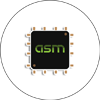

# Hello there :wave:

#### I'm Nave, a keyboard enthusiast that obviously got into the hobby because I program since I was 14, not because of "Fjell with lubed Holy Pandas".
~ B.Sc CS Ben Gurion University graduate with an average of 82. Looking for a software engineer position in Java/C/C++/Python/JS/TS.

~ I'm currently working on a CMS like web application through a MERN Udemy course, to eventually be used as a web application for materials to aid students of CS courses in BGU.
##

###
Experienced in:

[][2]  [][3]  [][4]  [][5]  [][6]  [][7]  [][8]  [][9]

##### Random things about yours truly:
* Got some experience with Manjaro but am looking for the ideal distro to escape Windows.
* Scored 100 in the Systems Programming course, 92 in Compiler Construction, 100 in Introduction to 3D Animations with OpenGL, 98 in Topics in Natural Language Processing, 95 in Topics in Error Correcting Codes and 96 in Operating Systems.
* Took a Functional Programming course which ended up being 98% a Lambda Calculus course and 2% functional programming and aced it.
* I daily an ergonomic keyboard with lubed and filmed Holy Bobas.
* Interned at Cybereason, where I've built a [dashboard](https://github.com/ThatGuyVanquish/CRStarshipDemo) to monitor Kubernetes on GCP through Prometheus.
* Love computer hardware, built my first computer at 13, then proceeded to physically modify it and overclock. Probably the reason I built my [Qt PC Part Picker](https://github.com/ThatGuyVanquish/QtPCPartPicker).

### Reach me:

[][1]

[1]: https://www.linkedin.com/in/nave-hersco/
[2]: https://github.com/ThatGuyVanquish/SPL-Assignment-2
[3]: https://github.com/ThatGuyVanquish/3DAnimations_FP
[4]: https://github.com/ThatGuyVanquish/QtPCPartPicker
[5]: https://github.com/ThatGuyVanquish/ESPL
[6]: https://github.com/ThatGuyVanquish/CC_FP
[7]: https://github.com/ThatGuyVanquish/CC_AS2
[8]: https://github.com/ThatGuyVanquish/ReedSolomon_Sage
[9]: https://github.com/ThatGuyVanquish/PPL-Assignment-4

<!--
**ThatGuyVanquish/ThatGuyVanquish** is a ✨ _special_ ✨ repository because its `README.md` (this file) appears on your GitHub profile.

Here are some ideas to get you started:

- 🔭 I’m currently working on ...
- 🌱 I’m currently learning ...
- 👯 I’m looking to collaborate on ...
- 🤔 I’m looking for help with ...
- 💬 Ask me about ...
- 📫 How to reach me: ...
- 😄 Pronouns: ...
- ⚡ Fun fact: ...
-->
